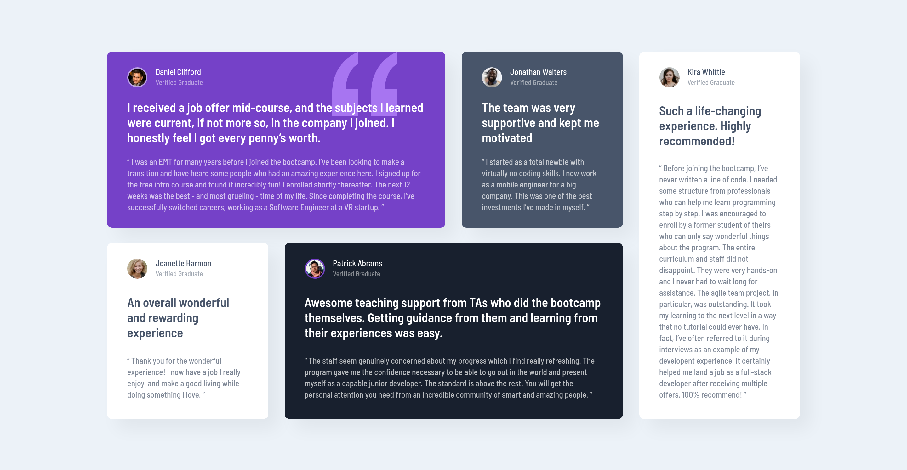

# Testimonials grid section solution

This is a solution to the [Testimonials grid section challenge on Frontend Mentor](https://www.frontendmentor.io/challenges/testimonials-grid-section-Nnw6J7Un7). It was a lot of fun making this page, I hope you like the result!

## Table of contents

- [Overview](#overview)
  - [The challenge](#the-challenge)
  - [Result](#result)
    - [Desktop](#desktop)
    - [Mobile](#mobile)
- [Built with](#built-with)

## Overview

### The challenge

Users should be able to:

- View the optimal layout for the site depending on their device's screen size.

### Result

#### Desktop

#### Mobile

## Built with

|                                        Technologies and techniques                                        |
| :-------------------------------------------------------------------------------------------------------: |
|                                     [HTML5](https://devdocs.io/html/)                                     |
|                                      [CSS3](https://devdocs.io/css/)                                      |
|                           [Grid Layout](https://devdocs.io/css/css_grid_layout)                           |
|                   [Flexible Box Layout](https://devdocs.io/css/css_flexible_box_layout)                   |
| [Mobile-first](https://developer.mozilla.org/en-US/docs/Web/Progressive_web_apps/Responsive/Mobile_first) |

<h4 align="center">
  Challenge completed! :heavy_check_mark:
</h4>
